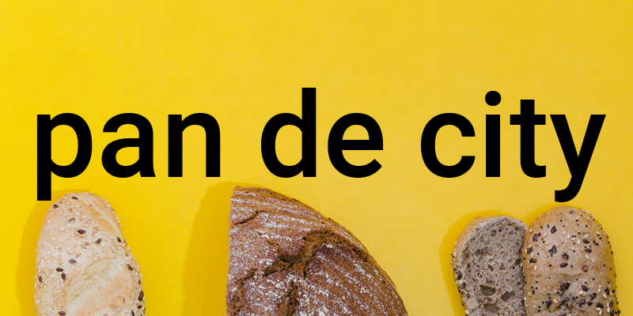

  

🍞 pan de city
============
Pan de City is a platform that helps users discover and review local bakeries. 

Satisfy your cravings and support local businesses. pan de city is your go-to source for finding the the best bakeries in town. Share your experiences, and help others find their slice, tart, or loaf of happiness.

Users are able to search for businesses based in the Seattle, San Francisco, and New York City areas, where they can read reviews from other users, 
and find contact business information to help find the best bake in town.

  ### [get that bread, literally](https://pan-de-city-66ed6944c4c5.herokuapp.com/)

  
  

📝 App Overview
============
Pan de City was developed using Mongo DB, Express, React, and Node featuring:

- **CRUD Operations:** for managing bakery listings profile, and user reviews.

- **RESTful Routing:** for efficient API design.

- **Authentication:** to ensure user account and review integrity.

- **Google Places API Integration (3rd Party):** to provide accurate information on local bakeries.

- **Chakra UI:** to enhance the overall user experience.

💻 Technologies Used
==============

📸 Screenshots
==============
### Wireframe

### ERD

### Mid-Development

### Deployed

🔧 Getting Started 
============
### Prerequisites
- Ensure you have a modern web browser installed on your device, such as Google Chrome, Firefox, Safari, or Edge.
- To access full CRUD capabilities, please be sure to sign up/log in to pan de city.

### Installation
No installation required, however, internet access is necessary.

⏭️ Next Steps
============
- [ ] Improve optimization for mobile screens.
- [ ] Update UI to include community collections by city.
- [ ] Additional Google Maps Integration: Render bakery locations on a map.
- [ ] Ability to search community collection(s) for bakeries by name or location.
- [ ] Connect to Cloud storage (e.g., AWS S3) to store user images to enhance review  experience.
- [ ] Ability to share on other social media platforms.
- [ ] Inclusion of dietary concerns, (Sorry gluten-free friends. This is top priority!!)
